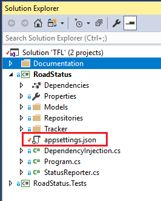
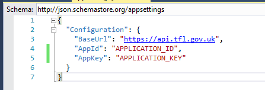
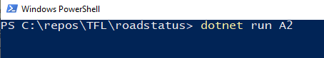
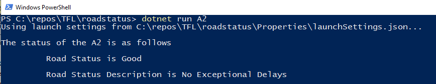
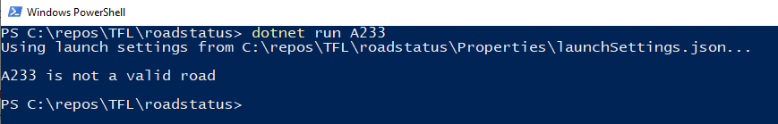
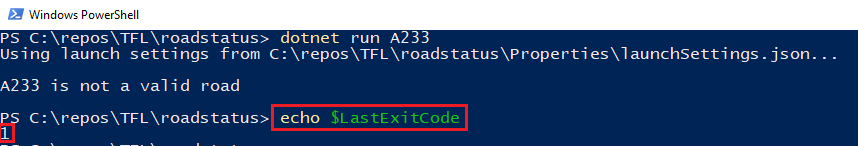

# TFL: Road API Client application:

Road API Client application is built in Windows platform using below mentioned projects:
1) **RoadStatus** : is a Console client application built in C# .net core 2.0 using Visual Studio 2017.
   This project has NuGet dependencies included for dependency injection, file configuration and newtonsoft for deserialization.
   For complete list of dependencies and their versions, you can refer to RoadStatus.csproj file:

2) **RoadStatus.Tests** : is the test application built in MS Test unit testing framework and Moq is used as a mocking framework.
   For complete list of dependencies and their versions, you can refer to RoadStatus.Tests.csproj file:

*	How to build the code
    1) Once the solution is cloned/downloaded from GitHub repository then it can be built using VS2017
    2) During build process, VS2017 should be able to download NuGet dependencies mentioned in *.csproj files assuming NuGet server is configured correctly in VS2017

*	How to run the output
    1) In order to use it you will need to register for a developer key here: https://api-portal.tfl.gov.uk/
    2) After registering, you will be provided with Application Id and Application Key
    3) Go to appsettings.json file in the project folder in the location shown below:
      
       
    4) Replace "APPLICATION_ID" with the Application Id and "APPLICATION_KEY" with the Application Key values provided after registering.
     

    5) Open powershell and go to directory location of 'RoadStatus' project. 
       Assuming, the solution was downloaded in C:\repos\TFL> folder then the folder location of 'RoadStatus' project will be C:\repos\TFL\roadstatus>.
       Go to project folder and type below commands for scenarios mentioned below:
    
      **Scenario 1: Valid road name is passed as parameter**:
       Type the command shown in below screenshot in powershell window:
       
       Here A2 is the parameter for valid road name.
    
       Once you press the 'Enter' key after this command then you will be presented with below shown ouptut for valid road name:
       

       Immediately after getting output for valid roadname, you can enter **echo $LastExitCode** to see the value of exit code as shown below:
       

      **Scenario 2: Invalid road name is passed as parameter**:
       Type the command shown in below screenshot in powershell window:
       
       Here A233 is the parameter for invalid road name.
    
       Once you press the 'Enter' key after this command then you will be presented with below shown ouptut for invalid road name:
       

       Immediately after getting output for invalid roadname, you can enter **echo $LastExitCode** to see the value of exit code as shown below:
       
        

*	How to run any tests that you have written

*	any assumptions that you’ve made

*	anything else you think is relevant
