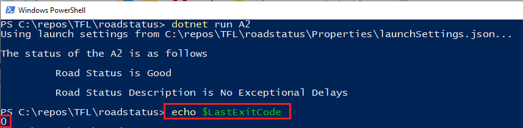
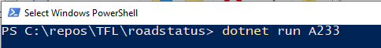
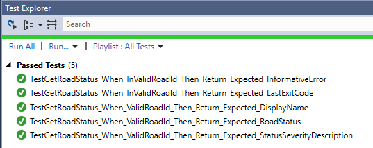

# TFL: Road API Client application:

Road API Client application is built using **RoadStatus** project as console client application and **RoadStatus.Tests** project to cover unit testing.
Both these projects are under TFL.sln solution. C# .net core 2.0 with VS 2017 is used to build this solution on Windows 10 platform.

**RoadStatus** : This project uses NuGet packages for dependency injection and file configuration from Microsoft .net core and deserialization from Newtonsoft.
   For complete list of dependencies and their versions used in this project, you can refer to RoadStatus.csproj file:

*	How to build the code
    1) Once the solution is cloned/downloaded from GitHub repository then it can be built using VS2017
    2) During build process, VS2017 should be able to download NuGet dependencies mentioned in *.csproj files assuming NuGet server is configured correctly in VS2017

*	How to run the output
    1) In order to use it you will need to register for a developer key here: https://api-portal.tfl.gov.uk/
    2) After registering, you will be provided with Application Id and Application Key
    3) Open TFL.sln solution in VS 2017 and then go to appsettings.json file in the RoadStatus project folder in the location shown below:
    
      

       
    4) Replace "APPLICATION_ID" with the Application Id and "APPLICATION_KEY" with the Application Key values provided after registering.
    
     

    5) Open powershell and go to directory location of 'RoadStatus' project. 
       Assuming, the solution was downloaded in C:\repos\TFL> folder then the folder location of 'RoadStatus' project will be C:\repos\TFL\roadstatus>.
       Go to project folder and type below commands for scenarios mentioned below:
    
      **Scenario 1: Valid road name is passed as parameter**:
       Type the command shown in below screenshot in powershell window:

       

       Here A2 is the parameter for valid road name.
    
       Once you press the 'Enter' key after this command then you will be presented with below shown ouptut for valid road name:

       

       Immediately after getting output for valid road name, you can enter **echo $LastExitCode** to see the value of last exit code as shown below:

       

      **Scenario 2: Invalid road name is passed as parameter**:
       Type the command shown in below screenshot in powershell window:

       

       Here A233 is the parameter for invalid road name.
    
       Once you press the 'Enter' key after this command then you will be presented with below shown ouptut for invalid road name:

       

       Immediately after getting output for invalid roadname, you can enter **echo $LastExitCode** to see the value of last exit code as shown below:

       
        
**RoadStatus.Tests** : is the test application built in MS Test unit testing framework and Moq is used as a mocking framework.
   For complete list of dependencies and their versions, you can refer to RoadStatus.Tests.csproj file:

*	How to run any tests that you have written
  1) Open RoadStatus solution in VS2017 and then open Test Explore from Test menu under Windows submenu.
  2) Run All test using test explorer and you should see all test passed as shown below:

     
    

*	any assumptions that you’ve made
  1) As per instructions given in the requirement document, assumption is made that results from TFL Road api will be presented only in console application.
  2) If there is a requirement to present the results from Tfl Road api not only in console application but also in other type of applications as well eg: ASP.Net/WPF/Winform then there is
     further scope to seperate the logic from this project in a dll that could then be used in either console application or ASP.Net/WPF/Winform etc.
  3) To adhere to the instructions in document, I have created unit test only for those scenarios mentioned in the requirement document otherwise there is further scope to add more unit tests
  4) When invalid value for AppId/AppKey are used in appsettings.json then assumption is made that the response will be read from the server but such response will fail to serialize and this exception will be handled as generic exception and then presented in console of the application.
  5) When invalid value for BaseUrl is used in appsettings.json then assumption is made the exception thrown will be handled as generic exception which will then be presented in console of the application.
  6) There is scope to handle specific exception instead of handling the exceptions as generic exception but assumption is made that it is out of scope of the requirement
  7) Assumption is made that only 1 road name will be passed as command line argument to the console application
  8) Assumption is made that the response from road api service with success status array will have only 1 item in it

*	anything else you think is relevant
  1) TDD approach is followed in this solution by creating unit tests with mock data then followed by implementation and refactoring.
     This can be confirmed by looking at the code history in GitHub
  